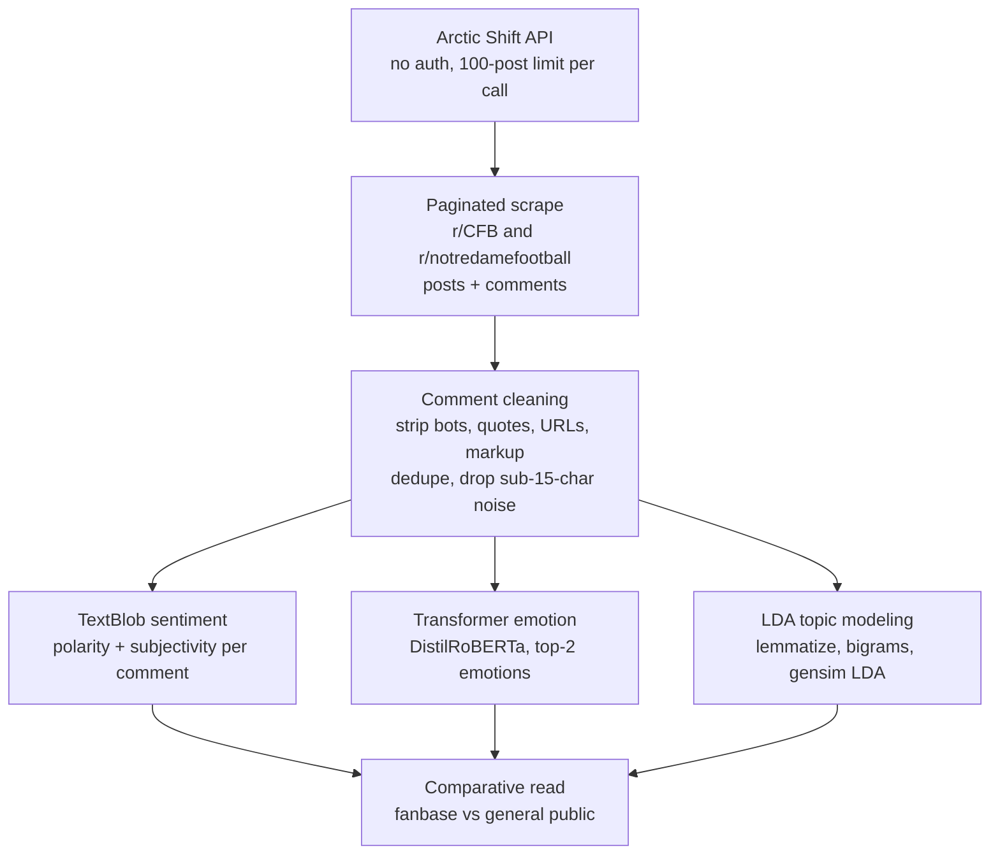

# Notre Dame Football Reddit Sentiment Analysis

**An NLP pipeline comparing how the fanbase and the general public react to Notre Dame football moments.**

This project scrapes Reddit and measures how two very different audiences process the same Notre Dame football event: the team's own fans on r/notredamefootball and the wider college-football crowd on r/CFB. It pulls comment data through the Arctic Shift API, runs two flavors of sentiment analysis plus LDA topic modeling, and lays the two communities side by side.

<p>
  
  
  
  
  
  
</p>

---

> ### TL;DR
> - **Question.** When Notre Dame stumbles, do its own fans and the rest of college football feel the same way about it? This project measures the gap.
> - **Approach.** I scraped r/CFB and r/notredamefootball comments through the Arctic Shift API, cleaned the text, and ran three layers of analysis: TextBlob polarity and subjectivity, a transformer emotion classifier, and LDA topic modeling.
> - **Two events.** The pipeline was pointed at two moments: Notre Dame getting upset by Northern Illinois in 2024, and Notre Dame getting left out of the 2025 playoff.
> - **What turned up.** After the NIU loss, the fanbase reacted with fear about the program's direction while the general public lit up with joy. The playoff snub stung far less, since the prior year's playoff run had banked some confidence.

---

## Table of Contents
1. [The Question](#1-the-question)
2. [What Makes Reddit Sentiment Hard](#2-what-makes-reddit-sentiment-hard)
3. [System Overview](#3-system-overview)
4. [Getting the Data](#4-getting-the-data)
5. [Cleaning the Comments](#5-cleaning-the-comments)
6. [Sentiment: Polarity and Subjectivity](#6-sentiment-polarity-and-subjectivity)
7. [Emotion Classification](#7-emotion-classification)
8. [Topic Modeling](#8-topic-modeling)
9. [Reading the Reaction](#9-reading-the-reaction)
10. [Reusing the Pipeline](#10-reusing-the-pipeline)
11. [Limitations](#11-limitations)
12. [Future Directions](#12-future-directions)
13. [Tech Stack](#13-tech-stack)
14. [Repository Structure](#14-repository-structure)
15. [Reproducing the Pipeline](#15-reproducing-the-pipeline)
16. [About the Author](#16-about-the-author)

---

## 1. The Question

A bad loss means something different depending on where you sit. To a Notre Dame fan, an upset is a gut punch and a referendum on the program. To everyone else in college football, it can be comedy. I wanted to put numbers on that gap.

The setup compares two Reddit communities reacting to the same Notre Dame moment. One is r/notredamefootball, where the fanbase lives. The other is r/CFB, the sport's general gathering place. Pull both communities' comments around a single event, run them through identical analysis, and the difference in how each group handles the moment becomes visible.

I pointed the pipeline at two events. The first was Notre Dame's 2024 upset loss to Northern Illinois, a result that landed as a real shock. The second was the team getting left out of the 2025 playoff. Two different flavors of disappointment, which made for a useful contrast.

---

## 2. What Makes Reddit Sentiment Hard

Sports comment threads are a hard target for sentiment tools. The text runs short and sarcastic, full of slang and in-jokes that a general-purpose model never trained on. A comment like "great job as always, fellas" might be praise or it might be a fan twisting the knife, and a lexicon model has no way to tell.

A few of the challenges that shaped the build:

| Challenge | Why it bites | How the pipeline handles it |
|---|---|---|
| **Sarcasm and irony** | A model reads the words, not the tone behind them | Two independent sentiment passes, so a lexicon score and an emotion model can be cross-checked |
| **Reddit cruft** | Bot posts, quoted replies, deleted text, and markup pollute the signal | A cleaning pass that strips quotes, URLs, markup, and known bot phrases |
| **Upvotes are not approval** | A comment's score reflects timing and visibility as much as agreement | Upvotes used as a rough engagement weight, never as ground truth |
| **Slang-heavy topics** | Off-the-shelf stopword lists miss football jargon | A custom stopword list tuned to college-football and Notre Dame chatter |

The project does not pretend these are solved. The aim is a directional read on the mood of two communities, with the contrast between them carrying the insight.

---

## 3. System Overview



---

## 4. Getting the Data

The comment data comes from the Arctic Shift API, a public archive of Reddit content. It needs no authentication, which keeps the barrier low, though it does cap each request at 100 posts.

The scraper works around that cap by paging through results. Each call grabs up to 100 posts, notes the timestamp of the last one, and uses it as the starting point for the next call, walking forward through the event window until it has enough. For every post it pulls, a second pass fetches the comment threads. The two get merged into one table keyed on post id.

```python
def get_reddit_posts_comments(subreddit, search, total_posts=500,
                              comments_per_post=50, start_date=None, end_date=None):
    ...
```

The pull keeps the fields that matter for analysis: post title and body, comment text, author, score, and the unix timestamp on each. Everything downstream runs off the comment text, with the score and timestamp on hand for weighting and filtering.

---

## 5. Cleaning the Comments

Raw Reddit text is messy, so the cleaning pass does real work before any model sees a word. Each comment runs through a filter that:

- drops anything empty, missing, or shorter than fifteen characters
- removes deleted and removed posts, along with known bot phrases like "I am a bot"
- unescapes HTML entities
- strips quoted lines, where a commenter is replying to someone else's text
- pulls out URLs, stray non-breaking-space characters, and line breaks
- collapses runs of whitespace down to single spaces

After cleaning, the pipeline drops empty results and removes duplicate comments, so a copy-pasted talking point does not get counted ten times over. What comes out the other side is a deduplicated set of real comment text, ready for analysis.

---

## 6. Sentiment: Polarity and Subjectivity

The first sentiment pass runs on spaCy with a TextBlob extension (spacytextblob). Every comment gets two scores. Polarity runs from -1 for strongly negative up to +1 for strongly positive. Subjectivity runs from 0 for clinical and factual up to 1 for pure opinion. Both land back in the master table.

The figures throughout this section come from the Northern Illinois run, which produced the sharper split between the two communities. Plotting polarity as a density curve for each subreddit makes the mood gap easy to see.


*Polarity distribution for each subreddit after the Northern Illinois upset.*

The clearest pattern in the NIU comparison was intensity. Both communities pushed toward the extremes far more after the Northern Illinois upset than after the playoff snub. The loss was shocking in a way the snub was not, and the comments carried that. A second view, plotting polarity against subjectivity, shows how opinion-heavy the reaction ran.


*Polarity against subjectivity for both subreddits after the NIU loss.*

---

## 7. Emotion Classification

The second pass goes deeper than positive-versus-negative. A transformer model, DistilRoBERTa fine-tuned for emotion, reads each comment and returns its top two emotions from a set of seven: anger, disgust, fear, joy, neutral, sadness, and surprise. Each comment ends up tagged with a primary and a secondary emotion, plus a confidence score for each.

To connect emotion to engagement, I plotted comment score by emotion for each subreddit, with outliers hidden so the bulk of the distribution stays readable.


*Comment score by primary emotion, split by subreddit, after the NIU loss.*

This is where the two communities split most sharply. In r/CFB, joyful comments drew heavy upvotes, the general crowd piling on while Notre Dame stumbled. In r/notredamefootball, fear was the emotion that climbed the upvote charts, a pattern that simply was not there after the playoff snub. Following the NIU loss, the fanbase was anxious about where the program was heading, full of questions about Marcus Freeman and worn down by a revolving door of transfer quarterbacks. The playoff snub did not trigger the same fear, because the 2024 playoff run had already shown fans the team could get there.

---

## 8. Topic Modeling

The last layer moves from how people felt to what they were talking about. For that I used LDA, which sorts a body of text into a set of latent topics based on which words tend to cluster together.

Getting comments ready for LDA took a few steps. The text gets broken down to the word level, lemmatized so that "questioning" and "questions" collapse to one root, and scanned for common bigrams so paired terms hold together. A custom stopword list does heavy lifting here, stripping out the obvious football vocabulary (game, team, Irish, coach, and the like) that would otherwise dominate every topic and say nothing.

The fitted model sorts the comments into five topics, which I explored with pyLDAvis, an interactive view that maps topics by size and overlap and ranks the terms inside each one.


*A static snapshot of the interactive pyLDAvis output from the NIU comment set. The live version is explorable in the notebook.*

---

## 9. Reading the Reaction

Put the three layers together and a clear story emerges from the NIU comparison. The general college-football audience treated Notre Dame's upset as entertainment, and its happiest comments were the ones that got rewarded. The fanbase lived the same result as a crisis, and its fear rose to the top. The intensity on both sides ran hotter than it did for the playoff snub months later, because a loss to Northern Illinois was a genuine shock while missing the playoff, painful as it was, came with the cushion of a recent deep run.

The value here is practical. This is the kind of read a communications or fan-engagement group inside an athletic department would want before deciding how to message a tough result, and it falls straight out of comment data that anyone can pull.

---

## 10. Reusing the Pipeline

The whole thing is built to be repointed. The two scraper calls each take a subreddit, a search term, and a date window, so swapping in any two communities and any event is a matter of changing arguments. The dates are unix timestamps, which keeps the window precise down to the second.

```python
# Notre Dame left out of the 2025 playoff
df_cfb = get_reddit_posts_comments(subreddit="CFB", search="Notre Dame",
                                   total_posts=100,
                                   start_date=1765065600, end_date=1765151999)
df_nd = get_reddit_posts_comments(subreddit="notredamefootball", search="Notre Dame",
                                  total_posts=400, comments_per_post=100,
                                  start_date=1764997200, end_date=1765256399)
```

One thing to remember when you repoint it: the topic-modeling stopword list is tuned to college football and Notre Dame. Aim the pipeline at a different sport or subject and you will want to rebuild that list, or the topics will fill up with the new domain's filler words.

---

## 11. Limitations

I would rather name the weak spots than let a reader assume there are none.

- **Lexicon sentiment misreads sports talk.** TextBlob scores the words on the page and misses the tone behind them, so sarcasm, irony, and trash talk routinely fool it. The transformer emotion pass helps, but neither model was trained on sports discourse.
- **Reddit is not a representative sample.** The users who post skew young, online, and highly engaged. They are not a stand-in for the whole fanbase or the broader public, so the findings describe Reddit's most active corners more than they describe everyone else.
- **The comparisons are visual, not tested.** Density plots and boxplots show differences, but the project does not run significance tests on whether those differences would hold up statistically. The reads are directional.
- **Upvotes are a noisy signal.** A comment's score depends on when it was posted and how visible it became, not only on whether people agreed. Using it as an engagement measure carries that noise.
- **Topic quality is subjective.** The five-topic count was set by hand rather than derived, and no coherence score was computed to back it. The stopword list also steers the topics heavily.
- **Two events is a small base.** Findings drawn from two Notre Dame moments are illustrative. They are not enough to generalize about how fanbases behave across the board.
- **The fifteen-character floor drops short reactions.** Quick hits like "wow" or "called it" carry real sentiment, and the cleaning step cuts them to reduce noise. That trades a little signal for a lot less junk.

---

## 12. Future Directions

- **Train on sports discourse.** Fine-tuning the sentiment and emotion models on labeled sports comments, or adding a sarcasm detector, would cut the biggest source of error.
- **Add statistical testing.** A Mann-Whitney test on the polarity distributions would turn "these look different" into a defensible claim about whether they really are.
- **Broaden the comparison.** Running the same pipeline across many events and many team subreddits would show whether the fan-versus-public gap holds as a general pattern.
- **Track sentiment over time.** Following a fanbase across a whole season, rather than a single event window, would surface how mood builds and breaks.
- **Bring in BERTopic and score coherence.** Comparing LDA against a transformer-based topic model, with coherence scores on both, would put the topic choices on firmer ground.
- **Go aspect-based.** Measuring sentiment toward specific targets, a coach or a quarterback, would sharpen the read beyond a whole-comment score.
- **Build a live dashboard.** A version that refreshes after each game would turn a one-off study into a standing fan-sentiment monitor.

---

## 13. Tech Stack

| Category | Tools |
|---|---|
| **Language** | Python 3.10+ |
| **Data source** | Arctic Shift API (public Reddit archive) |
| **Wrangling** | `pandas` |
| **Text cleaning** | `re`, `html`, `emoji` |
| **Sentiment** | `spaCy` (en_core_web_lg), `spacytextblob`, `TextBlob` |
| **Emotion** | `transformers` (j-hartmann/emotion-english-distilroberta-base), `torch` |
| **Topic modeling** | `gensim` (LDA, Phrases), `NLTK` |
| **Visualization** | `plotnine`, `matplotlib`, `seaborn`, `pyLDAvis` |

---

## 14. Repository Structure

```
nd-football-reddit-sentiment/
├── README.md
├── requirements.txt
├── src/
│   └── reddit_sentiment.py     # full pipeline: scrape, clean, sentiment, emotion, topics
├── reports/
│   └── figures/
│       ├── polarity_density.png
│       ├── polarity_subjectivity_scatter.png
│       ├── emotion_boxplot.png
│       └── lda_pyldavis.png
└── .gitignore
```

---

## 15. Reproducing the Pipeline

```bash
# 1. Environment
python -m venv .venv && source .venv/bin/activate
pip install -r requirements.txt

# 2. One-time model and corpus downloads
python -m spacy download en_core_web_lg
python -c "import nltk; nltk.download('stopwords'); nltk.download('punkt')"

# 3. Run the pipeline
python src/reddit_sentiment.py
```

**`requirements.txt`**
```
pandas
requests
emoji
spacy
spacytextblob
textblob
transformers
torch
gensim
nltk
plotnine
matplotlib
seaborn
pyLDAvis
```

---

## 16. About the Author

Built by **Tommy Gillan**. I hold an M.S. in Business Analytics with a Sports Analytics concentration from the University of Notre Dame, with a background that runs from sports media into data science.

This one sits at the meeting point of my two backgrounds. I came up in sports media before moving into data, and a project like this is what happens when those two halves run together. Pulling thousands of raw comments is the easy part. The work that earns its keep is turning that noise into a read someone in a press box or a marketing meeting could put to use.

*Connect:* [LinkedIn](https://www.linkedin.com/in/tommy-gillan/) · [Email](mailto:thomasgillan63@gmail.com) · [Portfolio](https://github.com/tgillz63)

---

<sub>Comment data retrieved from the public Arctic Shift Reddit archive. This is an independent research project with no affiliation to Notre Dame, Reddit, or the College Football Playoff.</sub>
